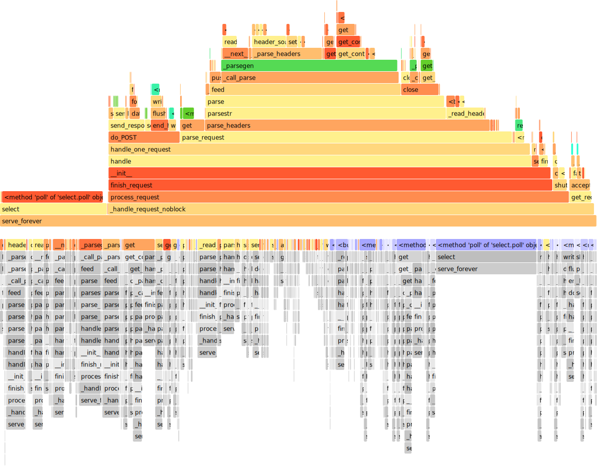

# Assignment 2

Tongzhou Gu, Juyi Lin, Li Zhou

## Q1

**For Device A:**

$100\mathrm{Gb/s} = 12.5\mathrm{GB/s}$

Transmission Latency: $\frac{128\mathrm{B}}{12.5\mathrm{GB/s}}=10.24ns$

Total Latency: $10.24ns+5ms=5010.24ns$

**For Device B:**

$125\mathrm{Gb/s} = 15.625\mathrm{GB/s}$

Transmission Latency: $\frac{128\mathrm{B}}{15.625\mathrm{GB/s}}=8.192ns$

Total Latency: $8.192\mathrm{ns}+6\mathrm{ms}=6008.192\mathrm{ns}$

Thus, **Device A is better**, because its total latency is smaller.

## Q2

We could build a 5-stage pipelined processor. In this case, the latency is determined by the component took the longest time.

We noticed `Operand fetch` may become the most time-consuming stage, which took up to 500ps if fetching an operand from the cache.

However, for the processor, it is much more frequent to operate on registers compared to caches. Thus, we could let `Operand fetch from cache` take 2 cycles to complete. So, right now, `Instruction decode` and `Execution unit` determine the processing frequency, which is

$f = \frac{1}{400\mathrm{ps}} = 2.5\mathrm{GHz}$

## Q3

Since the webserver speed most of the time on waiting connection if the webserver is idle. Here we simulate this scenario.

1. We measure the time starting at the server start
2. We generate 1000 requests in POST method to avoid cache used in GET and simulate the requests.
3. We measure the time when the server finished all the requests and quit.
4. We manually set a time counter to compare the running time of the server with/without profiler.

The result of default output is shown in `q3_output.txt`, and the svg is shown below

From the text result, it's not clear about the invoking relationship. But in the flame graph, it's more clear. There's the result analysis

1. The overhead time (socket initial time) is trivial, which is 0.15% of the total time.
2. The server spend 20% of the time on `select` function, which is used to wait for the connection.
3. We there's a request, the server spend 53.75% of the time on `parse_request` function, which is used to read the request and parse the header. The time for handling the request is only 11.68%, compared with the time for parsing the request, it's much smaller. So the header parser is the bottleneck of the server.
4. If we enable the profiler, the execution time is 9.48s, but without the profiler, the execution time is 2.39s. The profiler takes 7.09s, which is 296.23% of the execution time. The overhead is huge, but it's acceptable since the profiler is used for debugging only once or twice.

## Q4

There're 2 version of answer

### Version 1 Normal CPU

Here we assume the CPU EX unit can directly connect the Register write back, and the pipeline is the same as the course displayed. For each loop, there're 9 Instructions executed with 14 cycles. If n is big, the IPC is 9 / 14 = 0.64

For the detailed information, please refer to the `a2q4.xlsx` file, sheet 1. 

### Version 2. Advanced CPU

We assume our CPU supports speculative execution (including speculative load, which will load data from memory ahead of the previous memory write instructions and check whether those write instructions access the same memory address later), out-of-order execution and  register renaming. 

But, the state of our CPU is not recurrent, which means the pipeline's state is not repeated in the next loops. So, by estimation, our IPC is up to 9 instructions / 10 cycles = 0.9 roughly.

For the detailed information, please refer to the `a2q4.xlsx` file, sheet 2.